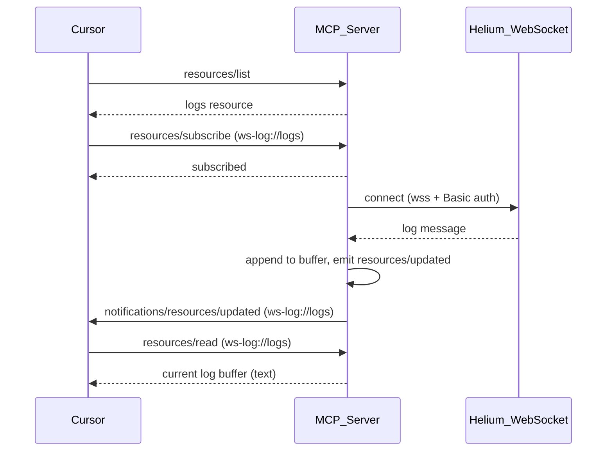

# WebSocket MCP Server

MCP server that connects to the Helium logging WebSocket and exposes live log entries to [Cursor](https://cursor.com) (or any MCP client) for debugging. It supports two transports:

**Install:** `npm install helium-rapid-websocket-mcp` or run with `npx helium-rapid-websocket-mcp`

- **stdio** (recommended for Cursor): Cursor spawns the server and passes config via `mcp.json` `env`. All credentials stay in mcp.json.
- **SSE**: The server runs as an HTTP process and Cursor connects via URL. New messages are pushed via MCP resource subscriptions over SSE.

## Architecture



## Prerequisites

- **Node.js** 18 or later
- **Cursor** with MCP support (or another MCP client)
- Credentials for the Helium logging WebSocket (username and password)

## Using the NPM package

No clone or build needed. Install and run directly:

```bash
npm install helium-rapid-websocket-mcp
```

Or use npx (no install):

```bash
npx helium-rapid-websocket-mcp
```

For Cursor stdio mode, add to `mcp.json` and point at the package:

- **npx:** `"command": "npx"`, `"args": ["-y", "helium-rapid-websocket-mcp"]`
- **Installed:** `"command": "node"`, `"args": ["${workspaceFolder}/node_modules/helium-rapid-websocket-mcp/build/index.js"]`

See [Cursor configuration](#cursor-configuration) for full examples.

## Configuration: credentials and WebSocket URL

The server expects configuration from the MCP server config only. Set `WS_URL`, `WS_USER`, and `WS_PASSWORD` (or `WS_AUTH`) in the `env` block of `.cursor/mcp.json`. Cursor passes these into the process when it spawns the server.

| Variable                     | Required | Description                                                                 |
| ---------------------------- | -------- | --------------------------------------------------------------------------- |
| `WS_URL`                     | Yes      | WebSocket endpoint, e.g. `wss://helium.mezzanineware.com/api/ws2/logging?appId=YOUR_APP_ID` |
| `WS_USER`                    | Yes      | Username for Basic auth (same as `wscat -c ... --auth $u:$p`)                |
| `WS_PASSWORD`                | Yes      | Password for Basic auth                                                     |
| `OUTPUT_TO_CURSOR_DEBUG_LOG` | No       | Set to `"true"` to pipe websocket output to a file for Cursor Debug mode     |
| `DEBUG_LOG_FILE`             | No*      | Path for the debug log file (e.g. `"${workspaceFolder}/.cursor/debug.log"`)  |

*`DEBUG_LOG_FILE` is required when `OUTPUT_TO_CURSOR_DEBUG_LOG` is true. Cursor resolves `${workspaceFolder}` when used in mcp.json.

**Alternative:** Use `WS_AUTH=username:password` instead of `WS_USER` and `WS_PASSWORD`.

You can use literal values in `mcp.json` or Cursor’s interpolation (e.g. `"WS_USER": "${env:HELIUM_USER}"`) to read from your shell environment. Do not commit `mcp.json` if it contains secrets; it is gitignored in this repo.

### Output to Cursor Debug log

When debugging with Cursor, you can pipe websocket output to a formatted file that the agent can read.

1. Set `OUTPUT_TO_CURSOR_DEBUG_LOG` to `"true"` in `mcp.json` `env`.
2. Set `DEBUG_LOG_FILE` to the output path, e.g. `"${workspaceFolder}/.cursor/debug.log"`.

Example `mcp.json` env block:

```json
"env": {
  "MCP_TRANSPORT": "stdio",
  "WS_URL": "wss://helium.mezzanineware.com/api/ws2/logging?appId=YOUR_APP_ID",
  "WS_USER": "your-username",
  "WS_PASSWORD": "your-password",
  "OUTPUT_TO_CURSOR_DEBUG_LOG": "true",
  "DEBUG_LOG_FILE": "${workspaceFolder}/.cursor/debug.log"
}
```

Log messages in Helium JSON format are parsed and written as: `{ISO timestamp} - {LEVEL} - {message}`. For example:

```
2026-02-13T10:45:18.651Z - WARN - WaterMapCurrent:feature groups fallback for layer=vw_geo_wa_pipe_full
```

Connection lifecycle events (open, close, error) are also written. Non-JSON or malformed messages are written unchanged.

## Setup

1. **Install dependencies**

   ```bash
   npm install
   ```

2. **Set configuration** (see [Configuration](#configuration-credentials-and-websocket-url) above): set `WS_URL`, `WS_USER`, and `WS_PASSWORD` (or `WS_AUTH`) in `mcp.json` `env`. For SSE mode, export them in your shell when starting the server.

3. **Optional:** Set `PORT` (default: `3000`) for the HTTP server in SSE mode.

4. **Build and run**

   ```bash
   npm run build
   npm start
   ```

   The server listens on `http://127.0.0.1:3000` (or your `PORT`). Endpoints:

   - **GET /mcp** — SSE stream (Cursor connects here)
   - **POST /messages** — JSON-RPC messages (used by the client with `?sessionId=...`)

   For development (run TypeScript without building):

   ```bash
   npm run dev
   ```

   To run the test script (`node test-get-logs.mjs`), set `WS_USER` and `WS_PASSWORD` in your environment (e.g. `export WS_USER=... WS_PASSWORD=...`).

## Cursor configuration

### Option A: stdio (config in mcp.json)

Configure the WebSocket URL and credentials in `mcp.json` so Cursor spawns the server. No separate server process needed.

1. Open **Cursor Settings** → **Features** → **MCP**.
2. Add to your `mcp.json` (project: `.cursor/mcp.json` or global: `~/.cursor/mcp.json`).

**Using npx** (no install, NPM package):

```json
{
  "mcpServers": {
    "helium-logs": {
      "command": "npx",
      "args": ["-y", "helium-rapid-websocket-mcp"],
      "env": {
        "MCP_TRANSPORT": "stdio",
        "WS_URL": "wss://helium.mezzanineware.com/api/ws2/logging?appId=YOUR_APP_ID",
        "WS_USER": "your-username",
        "WS_PASSWORD": "your-password",
        "OUTPUT_TO_CURSOR_DEBUG_LOG": "true",
        "DEBUG_LOG_FILE": "${workspaceFolder}/.cursor/debug.log"
      }
    }
  }
}
```

**Using installed NPM package:**

```json
{
  "mcpServers": {
    "helium-logs": {
      "command": "node",
      "args": ["${workspaceFolder}/node_modules/helium-rapid-websocket-mcp/build/index.js"],
      "env": {
        "MCP_TRANSPORT": "stdio",
        "WS_URL": "wss://helium.mezzanineware.com/api/ws2/logging?appId=YOUR_APP_ID",
        "WS_USER": "your-username",
        "WS_PASSWORD": "your-password",
        "OUTPUT_TO_CURSOR_DEBUG_LOG": "true",
        "DEBUG_LOG_FILE": "${workspaceFolder}/.cursor/debug.log"
      }
    }
  }
}
```

**Testing from source** (cloned repo, after `npm run build`):

```json
{
  "mcpServers": {
    "helium-logs": {
      "command": "node",
      "args": ["${workspaceFolder}/build/index.js"],
      "env": {
        "MCP_TRANSPORT": "stdio",
        "WS_URL": "wss://helium.mezzanineware.com/api/ws2/logging?appId=YOUR_APP_ID",
        "WS_USER": "your-username",
        "WS_PASSWORD": "your-password",
        "OUTPUT_TO_CURSOR_DEBUG_LOG": "true",
        "DEBUG_LOG_FILE": "${workspaceFolder}/.cursor/debug.log"
      }
    }
  }
}
```

`OUTPUT_TO_CURSOR_DEBUG_LOG` and `DEBUG_LOG_FILE` are optional; omit them or set `OUTPUT_TO_CURSOR_DEBUG_LOG` to `"false"` to disable piping logs to a file.

3. Restart Cursor or reload MCP servers.

### Option B: SSE (standalone HTTP server)

1. **Start the server** (see Setup above) so it is listening before Cursor connects.
2. Open **Cursor Settings** → **Features** → **MCP**.
3. Configure:
   - **Transport:** SSE (or select URL-based / remote server).
   - **URL:** `http://127.0.0.1:3000/mcp`  
     (Use your `PORT` if you changed it.)

Example `mcp.json` entry (server must be running with env vars set):

```json
{
  "mcpServers": {
    "websocket-logs": {
      "url": "http://127.0.0.1:3000/mcp"
    }
  }
}
```

Run the server with the WebSocket URL and credentials before connecting Cursor:

```bash
export WS_URL="wss://helium.mezzanineware.com/api/ws2/logging?appId=09a1e3ab-6219-4206-99fb-c5c68de47382"
export WS_USER="your-username"
export WS_PASSWORD="your-password"
npm start
```

## Usage in Cursor

- **Resource:** In the MCP / context UI, open the resource **WebSocket logs** (`ws-log://logs`). Subscribe to it so Cursor refreshes when new log lines arrive.
- **Tool:** The agent can call **get_ws_logs** to fetch recent log content. Optional argument: `lines` (number) to return only the last N lines.

## Security

- Do **not** commit credentials. Set `WS_USER` and `WS_PASSWORD` (or `WS_AUTH`) only in your `mcp.json` or, if using `${env:...}` interpolation, in your shell environment. Do not commit `mcp.json` if it contains secrets; it is gitignored in this repo.
