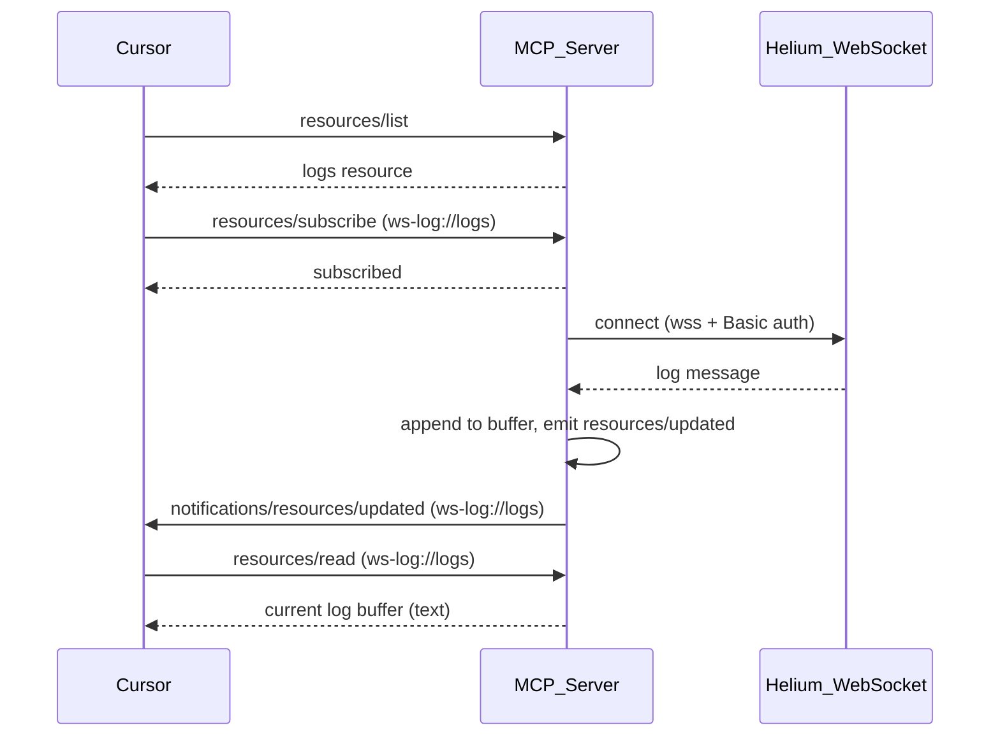

# WebSocket MCP Server

MCP server that connects to the Helium logging WebSocket and exposes live log entries to [Cursor](https://cursor.com) (or any MCP client) for debugging. It supports two transports:

**Install:** `npm install websocket-mcp` or run with `npx websocket-mcp`

- **stdio** (recommended for Cursor): Cursor spawns the server and passes config via `mcp.json` `env`. All credentials stay in mcp.json.
- **SSE**: The server runs as an HTTP process and Cursor connects via URL. New messages are pushed via MCP resource subscriptions over SSE.

## Architecture



## Prerequisites

- **Node.js** 18 or later
- **Cursor** with MCP support (or another MCP client)
- Credentials for the Helium logging WebSocket (username and password)

## Configuration: credentials and WebSocket URL

The server requires three values. Set them via environment variables or a `.env` file.

| Variable      | Required | Description                                                  |
| ------------- | -------- | ------------------------------------------------------------ |
| `WS_URL`      | Yes      | WebSocket endpoint, e.g. `wss://helium.mezzanineware.com/api/ws2/logging?appId=YOUR_APP_ID` |
| `WS_USER`     | Yes      | Username for Basic auth (same as `wscat -c ... --auth $u:$p`) |
| `WS_PASSWORD` | Yes      | Password for Basic auth                                     |

**Alternative:** Use `WS_AUTH=username:password` instead of `WS_USER` and `WS_PASSWORD`.

### Using a `.env` file

Create a `.env` file in the project root (or workspace root when using Cursor):

```
WS_URL=wss://helium.mezzanineware.com/api/ws2/logging?appId=YOUR_APP_ID
WS_USER=your-username
WS_PASSWORD=your-password
```

Or with `WS_AUTH`:

```
WS_URL=wss://helium.mezzanineware.com/api/ws2/logging?appId=YOUR_APP_ID
WS_AUTH=username:password
```

Add `.env` to `.gitignore` so credentials are never committed. A `.env.example` template is included in the repo.

### Using environment variables

If you prefer not to use a file, export in your shell or `mcp.json`:

```bash
export WS_URL="wss://helium.mezzanineware.com/api/ws2/logging?appId=..."
export WS_USER="your-username"
export WS_PASSWORD="your-password"
```

For `mcp.json`, use Cursor’s interpolation so credentials stay out of the config file:

- `"WS_USER": "${env:HELIUM_USER}"` — reads from your shell or `.env` loaded by Cursor
- `"WS_PASSWORD": "${env:HELIUM_PASSWORD}"` — same

Then set `HELIUM_USER` and `HELIUM_PASSWORD` in your environment, or use `envFile` in `mcp.json` to load a `.env` that defines them.

## Setup

1. **Install dependencies**

   ```bash
   npm install
   ```

2. **Set configuration** (see [Configuration](#configuration-credentials-and-websocket-url) above)

   - Use a `.env` file, or
   - Export `WS_URL`, `WS_USER`, and `WS_PASSWORD` (or `WS_AUTH`)

3. **Optional:** Set `PORT` (default: `3000`) for the HTTP server in SSE mode.

4. **Build and run**

   ```bash
   npm run build
   npm start
   ```

   The server listens on `http://127.0.0.1:3000` (or your `PORT`). Endpoints:

   - **GET /mcp** — SSE stream (Cursor connects here)
   - **POST /messages** — JSON-RPC messages (used by the client with `?sessionId=...`)

   For development (run TypeScript without building):

   ```bash
   npm run dev
   ```

## Cursor configuration

### Option A: stdio (config in mcp.json)

Configure the WebSocket URL and credentials in `mcp.json` so Cursor spawns the server. No separate server process needed.

1. Open **Cursor Settings** → **Features** → **MCP**.
2. Add to your `mcp.json` (project: `.cursor/mcp.json` or global: `~/.cursor/mcp.json`).

**Using npx** (no clone needed):

```json
"helium-logs": {
  "command": "npx",
  "args": ["-y", "websocket-mcp"],
  "env": {
    "MCP_TRANSPORT": "stdio",
    "WS_URL": "wss://helium.mezzanineware.com/api/ws2/logging?appId=YOUR_APP_ID",
    "WS_USER": "${env:HELIUM_USER}",
    "WS_PASSWORD": "${env:HELIUM_PASSWORD}"
  },
  "envFile": "${workspaceFolder}/.env"
}
```

**Using a local clone:**

```json
"helium-logs": {
  "command": "node",
  "args": ["${workspaceFolder}/node_modules/websocket-mcp/build/index.js"],
  "env": {
    "MCP_TRANSPORT": "stdio",
    "WS_URL": "wss://helium.mezzanineware.com/api/ws2/logging?appId=YOUR_APP_ID",
    "WS_USER": "${env:HELIUM_USER}",
    "WS_PASSWORD": "${env:HELIUM_PASSWORD}"
  },
  "envFile": "${workspaceFolder}/.env"
}
```

3. Create a `.env` file (see [Configuration](#configuration-credentials-and-websocket-url)) with `HELIUM_USER`, `HELIUM_PASSWORD`, and optionally `WS_URL`, or set those variables in your shell.
4. Restart Cursor or reload MCP servers.

### Option B: SSE (standalone HTTP server)

1. **Start the server** (see Setup above) so it is listening before Cursor connects.
2. Open **Cursor Settings** → **Features** → **MCP**.
3. Configure:
   - **Transport:** SSE (or select URL-based / remote server).
   - **URL:** `http://127.0.0.1:3000/mcp`  
     (Use your `PORT` if you changed it.)

Example `mcp.json` entry (server must be running with env vars set):

```json
"websocket-logs": {
  "url": "http://127.0.0.1:3000/mcp"
}
```

Run the server with the WebSocket URL and credentials before connecting Cursor:

```bash
export WS_URL="wss://helium.mezzanineware.com/api/ws2/logging?appId=09a1e3ab-6219-4206-99fb-c5c68de47382"
export WS_USER="your-username"
export WS_PASSWORD="your-password"
npm start
```

## Usage in Cursor

- **Resource:** In the MCP / context UI, open the resource **WebSocket logs** (`ws-log://logs`). Subscribe to it so Cursor refreshes when new log lines arrive.
- **Tool:** The agent can call **get_ws_logs** to fetch recent log content. Optional argument: `lines` (number) to return only the last N lines.

## Security

- Do **not** commit credentials or scripts that contain them. Use environment variables or a local wrapper that is not in version control.
- Keep `WS_USER` / `WS_PASSWORD` or `WS_AUTH` only in your environment or in a secure, uncommitted script.
